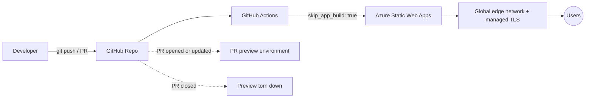

# yossefseit.github.io

**Personal portfolio, engineered and documented as a small Azure reference project — not just a hosted website.**

[](https://github.com/yossefseit/yossefseit.github.io/actions/workflows/azure-static-web-apps-gentle-smoke-06d712d0f.yml)
[](LICENSE)

🌐 **Live:** https://gentle-smoke-06d712d0f.7.azurestaticapps.net/

---

## Table of Contents

- [Project Overview](#project-overview)
- [Features](#features)
- [Technologies](#technologies)
- [Architecture](#architecture)
- [Repository Structure](#repository-structure)
- [CI/CD Flow](#cicd-flow)
- [Deployment Process](#deployment-process)
- [Why Azure Static Web Apps](#why-azure-static-web-apps)
- [Lessons Learned](#lessons-learned)
- [Future Improvements](#future-improvements)
- [Roadmap](#roadmap)
- [Quick Reference](#quick-reference)
- [License](#license)

---

## Project Overview

This repo hosts my personal portfolio, but it's structured to demonstrate how it's deployed, not just what it looks like:

- Static hosting on **Azure Static Web Apps**
- **GitHub Actions** CI/CD, including automatic PR preview environments
- The hosting resource defined as code in **Bicep**, not created by hand in the Portal
- Documented architecture and deployment decisions instead of undocumented click-ops

No frontend framework and no build step — plain HTML/CSS/JS by design, so the CI/CD and infra pieces stay easy to follow on their own.

## Features

- Responsive single-page portfolio (About, Experience, Certifications, Skills)
- Automatic deploys on push to `main`
- Automatic **PR preview environments** — every pull request gets its own temporary URL before anything reaches production
- Hardened HTTP response headers via `staticwebapp.config.json`
- Static Web App resource defined as code in `infra/main.bicep`

## Technologies

| Layer | Choice |
|---|---|
| Frontend | HTML5, CSS3, vanilla JavaScript |
| Hosting | Azure Static Web Apps (Free tier) |
| CI/CD | GitHub Actions |
| IaC | Bicep (`infra/main.bicep`) |
| Config | `staticwebapp.config.json` — security headers, route caching |

## Architecture



No build stage runs — the workflow uploads the static files directly, so GitHub Actions here is a *delivery* mechanism, not a build pipeline. Full write-up, including why that's a deliberate choice, in [`docs/architecture.md`](docs/architecture.md).

## Repository Structure

```
yossefseit.github.io
├── .github/workflows/          # CI/CD pipeline (GitHub Actions → Azure SWA)
├── assets/                     # Images, PDFs, certification badges
├── docs/
│   ├── architecture.md         # Design decisions, CI/CD + CDN explained
│   ├── deployment.md           # Deployment process & troubleshooting log
│   └── screenshots/            # planned
├── infra/
│   └── main.bicep              # Static Web App defined as code
├── index.html
├── staticwebapp.config.json    # Security headers, route caching
├── README.md
├── LICENSE
└── .gitignore
```

## CI/CD Flow

1. Push to `main` (or open a PR) triggers `.github/workflows/azure-static-web-apps-gentle-smoke-06d712d0f.yml`
2. The job requests a GitHub OIDC token and calls `Azure/static-web-apps-deploy@v1`
3. `skip_app_build: true` tells Azure **not** to run Oryx — files are uploaded as-is
4. On `main`: deploys straight to production
5. On a PR: deploys to an isolated preview URL; closing the PR tears it down automatically

## Deployment Process

Full walkthrough — including the Oryx build failure and the fix — is in [`docs/deployment.md`](docs/deployment.md). Short version: this is a static site with no `package.json`, so Azure's default build detection is disabled explicitly rather than worked around.

## Why Azure Static Web Apps

- Free tier covers a personal site with managed TLS + global CDN included
- GitHub Actions integration is native — no separate CI tool needed
- Free, automatic PR preview environments for reviewing changes before they're live
- Straightforward path to add an Azure Functions API later without switching hosting providers
- Manageable as code via Bicep/ARM, same as any other Azure resource

## Lessons Learned

- **Oryx assumed Node.js.** With no `package.json`, Azure's build detection still tried an Oryx Node build and failed looking for a `build` script. Fix: `skip_app_build: true` plus explicit `app_location`/`output_location`, so Azure treats this as pre-built static content instead of guessing.
- **A working deployment isn't a documented one.** The Portal-created resource worked fine but had no record of *why* it was configured that way — `infra/` and `docs/` exist to close that gap.
- **CSP vs. no build step is a real trade-off.** The page has a few inline `<script>`/`<style>` blocks, so `staticwebapp.config.json` currently allows `'unsafe-inline'` for those directives instead of maintaining brittle per-block hashes by hand — a deliberate call, documented in `docs/architecture.md`, not an oversight.

## Future Improvements

- [ ] Extract inline `<script>`/`<style>` blocks to external files, then tighten the CSP (drop `'unsafe-inline'`)
- [ ] Add a Terraform variant alongside the Bicep template
- [ ] Custom domain
- [ ] Basic Lighthouse/accessibility check as a CI step
- [ ] Screenshots in `docs/screenshots/`

## Roadmap

First in a small set of Azure reference projects, each following the same template (README, architecture doc, deployment doc, Bicep/Terraform, CI/CD):

- ✅ Azure Static Web Apps (this repo)
- ⬜ Azure App Service + Azure Functions
- ⬜ Azure Storage + Key Vault
- ⬜ Azure Container Apps + Docker

## Quick Reference

Operating this resource directly (replace `<rg>` / `<app>` with your resource group / Static Web App name):

```bash
# Resource details — default hostname, resource ID, SKU
az staticwebapp show --name <app> --resource-group <rg>

# List environments: production + every active PR preview
az staticwebapp environment list --name <app> --resource-group <rg>

# View/rotate the deployment token stored as the GitHub Actions secret
az staticwebapp secrets list --name <app> --resource-group <rg>

# Custom domains attached to this app
az staticwebapp hostname list --name <app> --resource-group <rg>

# Apply infra/main.bicep
az deployment group create --resource-group <rg> --template-file infra/main.bicep

# Run the site locally before pushing (Static Web Apps CLI)
swa start .
```

## License

MIT — see [LICENSE](LICENSE).