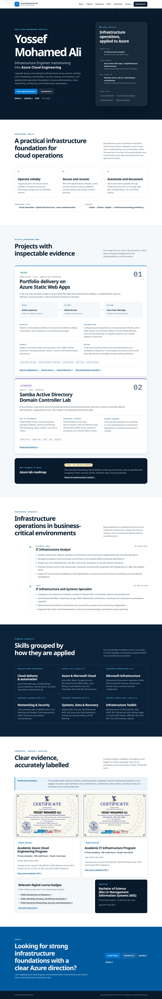
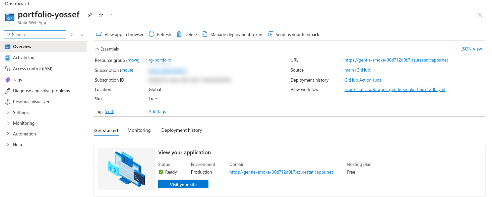
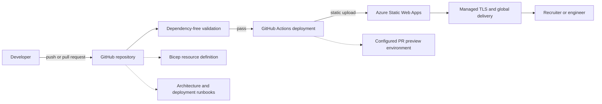

# Yossef Mohammed Ali — Azure Cloud Engineering Portfolio

An evidence-backed portfolio for an infrastructure professional transitioning into Azure Cloud Engineering. The site presents professional infrastructure experience, completed training, inspectable lab work, and a deployed Azure reference project without claiming unsupported production cloud experience.

[](https://github.com/yossefseit/yossefseit.github.io/actions/workflows/azure-static-web-apps-gentle-smoke-06d712d0f.yml)
[](LICENSE)

**Primary site:** [Azure Static Web Apps](https://gentle-smoke-06d712d0f.7.azurestaticapps.net/)

**Canonical origin:** `https://gentle-smoke-06d712d0f.7.azurestaticapps.net/`

> GitHub Pages currently serves the same repository as a secondary mirror. Search metadata selects the Azure deployment as the single canonical origin.



## What this repository demonstrates

- A responsive, semantic, dependency-light portfolio built with HTML, CSS, and a small amount of vanilla JavaScript
- Static delivery through **Azure Static Web Apps**
- Reusable Azure project catalogue at `/projects/`
- Detailed Secure Azure Hub-and-Spoke case study at `/projects/azure-secure-hub-spoke/`
- Optimized, lazily loaded SVG architecture content with a separate PNG social-preview asset
- Pre-deployment validation and delivery through **GitHub Actions**
- A reusable **Bicep resource definition** for the Static Web App
- A restrictive content security policy and defense-in-depth HTTP headers
- Documented deployment decisions, troubleshooting, evidence boundaries, and planned Azure labs
- Clear separation between professional experience, training, lab work, and planned work

This Azure Static Web App was initially connected through the Azure Portal. The resource configuration was subsequently codified in Bicep; this repository does not claim that the existing production resource was originally provisioned by the template.

## Project status

| Area | Status | Evidence |
|---|---|---|
| Azure production deployment | Live | Public Azure URL, redacted Portal overview, and successful main-branch workflow runs |
| Static-site validation | Implemented | `scripts/validate_site.py` runs locally and before deployment |
| GitHub Actions delivery | Implemented | Pinned actions, least permissions, static upload |
| Bicep resource definition | Implemented | `infra/main.bicep` |
| PR preview deployment | Verified | Trusted same-repository pull request #7 deployed successfully |
| PR preview cleanup | Platform-managed | Azure ties preview environments to pull requests and deletes them on close; portal verification remains manual |
| Secure Azure hub-and-spoke lab | Implemented and CI validated | [Public case study](projects/azure-secure-hub-spoke/) and [technical repository](https://github.com/yossefseit/azure-secure-hub-spoke); live Azure evidence pending |
| CV evidence language | Reconciled | Tagged, selectable PDF labels academy programs as training and separates deployed from CI-validated project evidence |
| Additional Azure labs | Planned | See [Azure lab roadmap](docs/azure-lab-roadmap.md) |



The resource owner supplied this redacted Portal overview. It confirms the live `portfolio-yossef` Static Web App, `rg-portfolio` resource group, production status, Free plan, GitHub source, and default hostname without publishing subscription metadata.

## Architecture



There is no application server, database, API, frontend framework, or package installation in the site itself. Azure receives the repository as already-built static content. See [docs/architecture.md](docs/architecture.md) for design details.

## Technology choices

| Layer | Implementation |
|---|---|
| Frontend | Semantic HTML5, modern CSS, vanilla JavaScript |
| Hosting | Azure Static Web Apps Free tier |
| CI/CD | GitHub Actions |
| Infrastructure as Code | Bicep |
| Validation | Python standard library |
| Security | CSP, HSTS, COOP/CORP, Permissions Policy, referrer and MIME controls |
| SEO | Canonical metadata, Open Graph/Twitter metadata, JSON-LD, sitemap, robots |

## Repository structure

```text
.
├── .github/workflows/
│   └── azure-static-web-apps-gentle-smoke-06d712d0f.yml
├── .cspell.json
├── .markdownlint-cli2.jsonc
├── AGENTS.md
├── assets/
│   ├── site.css
│   ├── site.js
│   ├── og-cover.png
│   ├── cv.pdf
│   └── training certificate assets
├── docs/
│   ├── architecture.md
│   ├── deployment.md
│   ├── azure-lab-roadmap.md
│   ├── validation.md
│   └── screenshots/
│       ├── azure-static-web-app-overview-redacted.png
│       ├── portfolio-desktop.png
│       └── portfolio-mobile.png
├── infra/
│   └── main.bicep
├── scripts/
│   └── validate_site.py
├── projects/
│   ├── index.html
│   └── azure-secure-hub-spoke/index.html
├── 404.html
├── index.html
├── robots.txt
├── sitemap.xml
└── staticwebapp.config.json
```

## Run locally

No build step or dependency installation is required.

```bash
git clone https://github.com/yossefseit/yossefseit.github.io.git
cd yossefseit.github.io
python3 -m http.server 8000
```

Open `http://localhost:8000`.

Run the repository checks separately:

```bash
python3 scripts/validate_site.py
```

The validator checks:

- local files, image sources, `srcset` entries, and in-page anchors
- required document metadata and heading structure
- accessible naming semantics for labelled generic containers
- image alternative text, intrinsic dimensions, and the optimized/lazy case-study architecture asset
- JSON-LD parsing
- new-tab link protections
- JSON and XML configuration
- canonical, sitemap, robots, CSP, and 404 consistency

The workflow also runs Node's built-in syntax check against the site JavaScript.

The latest measured browser, Lighthouse, workflow, Bicep, secret-scan, and emulator results are recorded in [docs/validation.md](docs/validation.md).

## Delivery workflow

For a push to `main`, or an open/update/reopened trusted same-repository pull request:

1. GitHub checks out the repository with persisted credentials disabled.
2. `scripts/validate_site.py` verifies the static site and deployment metadata.
3. CI checks JavaScript, HTML semantics, CSS, Markdown, spelling, the Bicep compile, and secrets.
4. GitHub requests a short-lived identity token.
5. `Azure/static-web-apps-deploy` receives the identity token and stored deployment token, then uploads the repository as static content.
6. A `main` push updates production; a trusted same-repository pull request is configured to receive a preview environment.
7. Azure automatically removes the preview environment when its pull request closes.

Dependabot and fork pull requests still run validation, but skip preview deployment because GitHub does not expose the required Azure secret to those events. All third-party actions are pinned to full commit SHAs. The Azure deployment token remains in GitHub Actions secrets and is never stored in this repository.

`skip_app_build: true` and an empty `output_location` intentionally bypass Oryx. This is a plain static site, so there is nothing to compile. The original build-detection failure and resolution are documented in [docs/deployment.md](docs/deployment.md).

## Security decisions

- The site has no form handler, API, analytics, third-party embed, or runtime data store.
- Inline executable JavaScript and inline CSS are disallowed.
- The one inline JSON-LD block is authorized by an explicit CSP hash.
- Credly credentials use direct links instead of third-party scripts and iframes.
- The CV is revalidated on each request instead of cached immutably for a year.
- New-tab links use `noopener noreferrer`.
- The workflow uses least-privilege job permissions and pinned action commits.
- No credentials, tokens, or connection strings belong in tracked files.

The repository is public and the Azure workflow uploads from its root, so tracked documentation and infrastructure files may also be publicly retrievable. They contain no secrets. A future build/output directory could narrow the published surface if GitHub Pages is retired.

## Content integrity

The current CV is the authority for employment, job titles, dates, education, and professional skills. Repository evidence supports the Azure Static Web Apps project, the separate Secure Azure Hub-and-Spoke technical repository, and the Samba AD DC lab. Project pages do not repeat the CV's phone number or other unnecessary personal details.

The downloadable CV and portfolio use the same conservative evidence boundary: IT Gate Academy PDFs are program-completion evidence, and vendor tracks are training objectives unless a vendor-issued verification link or credential ID is published. The CV also distinguishes deployed work from authored and CI-validated lab work. Planned labs are labelled **Planned** and are not mixed with deployed or professional work.

## Known limitations

- Pull request #7 verified preview deployment. Preview removal after close still needs confirmation in the Azure portal; the redundant close action was removed after it returned `No matching static site found`.
- `infra/main.bicep` compiles locally but still needs authenticated Azure `validate` and `what-if` checks before it should manage the existing production resource.
- GitHub Pages remains a duplicate host until it is disabled in repository settings.
- The CV is tagged and text-extractable; the issuer-provided academy PDFs remain untagged, which limits their screen-reader structure.
- Public vendor credential verification IDs were not available in this repository.
- Lighthouse must be rerun whenever visual or loading behavior changes; results should only be stated when an actual browser audit has completed.

## Planned Azure evidence

The next projects are designed to demonstrate role-relevant depth without representing lab work as employment:

1. Complete live evidence for the implemented hub-and-spoke lab when an authorized Azure context is available
2. Azure governance automation with Policy, RBAC, tags, budgets, and lifecycle controls
3. Azure Monitor incident response and recovery validation
4. Azure Backup with a documented restore test
5. Hybrid identity with AD DS and Microsoft Entra ID

Implementation order, acceptance criteria, security controls, and cost guardrails are in [docs/azure-lab-roadmap.md](docs/azure-lab-roadmap.md).

## License and personal documents

Source code and original documentation are available under the [MIT License](LICENSE). The CV, academy certificates, and third-party marks are personal or issuer-provided documents and are not granted for reuse by the MIT license.
