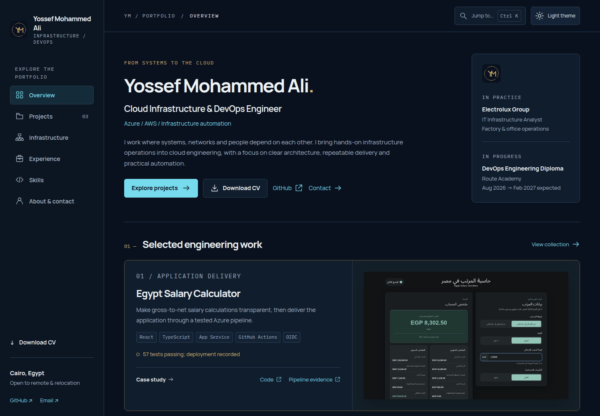
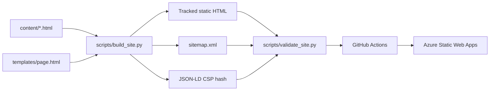

# Yossef Mohammed Ali — Infrastructure & DevOps Portfolio


A static portfolio designed as an infrastructure command centre: compact application navigation, evidence-led project case studies, readable architecture views, and a clear boundary between professional experience and personal lab work.

[](https://github.com/yossefseit/yossefseit.github.io/actions/workflows/azure-static-web-apps-gentle-smoke-06d712d0f.yml)
[](LICENSE)

[Portfolio](https://gentle-smoke-06d712d0f.7.azurestaticapps.net/) ·
[Projects](https://gentle-smoke-06d712d0f.7.azurestaticapps.net/projects/) ·
[GitHub profile](https://github.com/yossefseit) ·
[Download CV](https://gentle-smoke-06d712d0f.7.azurestaticapps.net/assets/Yossef_Mohammed_Ali_CV.pdf)

> The command-centre redesign is complete locally and ready for review. The Azure origin continues to serve the previously published release until these changes are reviewed and deployed.



[Light theme preview](docs/screenshots/portfolio-command-centre-light.png) ·
[Mobile landing preview](docs/screenshots/portfolio-command-centre-mobile-closed.png) ·
[Expanded mobile navigation](docs/screenshots/portfolio-command-centre-mobile.png) ·
[Infrastructure view](docs/screenshots/infrastructure-command-centre-desktop.png) ·
[Salary Calculator case study](docs/screenshots/salary-case-study-desktop.png)

## What the redesign delivers

- A responsive application shell with desktop sidebar navigation and a compact mobile menu
- Persistent light and dark themes, visible keyboard focus, and reduced-motion support
- A keyboard-accessible command palette for real routes and actions
- Early access to selected work, the CV, GitHub, and contact details
- Shareable case studies with architecture, implementation, decisions, validation, status, and learning
- An Infrastructure view covering the portfolio delivery path and personal Azure and identity labs
- Self-hosted Manrope and IBM Plex Mono fonts with no runtime third-party dependency
- Canonical metadata, Open Graph images, structured data, sitemap coverage, and a custom 404
- Static delivery through Azure Static Web Apps with restrictive security headers

The CV is the authority for employment titles, dates, education, and training status. Repository and workflow evidence support project claims separately. The site does not present personal labs as employer systems.

## Selected work

| Project | Current wording | Evidence |
|---|---|---|
| [Egypt Salary Calculator](https://gentle-smoke-06d712d0f.7.azurestaticapps.net/projects/egypt-salary-calculator/) | 57 tests passing; deployment recorded | [Source](https://github.com/yossefseit/egypt-salary-calculator) · [Dated deployment](https://github.com/yossefseit/egypt-salary-calculator/actions/runs/31909528455) |
| [Secure Azure Hub-and-Spoke Lab](https://gentle-smoke-06d712d0f.7.azurestaticapps.net/projects/azure-secure-hub-spoke/) | Lab: CI validated; Azure deployment pending | [Source](https://github.com/yossefseit/azure-secure-hub-spoke) · [CI evidence](https://github.com/yossefseit/azure-secure-hub-spoke/actions/runs/30944553717) |
| [Azure Governance Automation Lab](https://gentle-smoke-06d712d0f.7.azurestaticapps.net/projects/azure-governance-automation/) | Lab: CI validated; Azure deployment pending | [Source](https://github.com/yossefseit/azure-governance-automation) · [CI evidence](https://github.com/yossefseit/azure-governance-automation/actions/runs/31267342614) |
| [Samba AD DC Lab](https://gentle-smoke-06d712d0f.7.azurestaticapps.net/projects/samba-ad-dc-lab/) | Lab: CI validated; runtime validation pending | [Source](https://github.com/yossefseit/samba-ad-dc-lab) · [Workflows](https://github.com/yossefseit/samba-ad-dc-lab/actions) |
| Azure Static Web Apps Portfolio | Live delivery project; local redesign ready for review | This repository, its workflow, Bicep definition, and [delivery notes](docs/deployment.md) |

The Salary Calculator status refers to a fresh local run of 57 calculation and interface tests and a historical successful App Service deployment. It does not claim current demo availability. The Azure and Samba lab statuses distinguish authored, CI-validated work from pending authenticated or runtime validation.

## Public routes

The generator produces ten directly linkable pages:

| Route | Purpose |
|---|---|
| `/` | Concise identity, primary actions, and selected projects |
| `/projects/` | Curated project collection |
| `/infrastructure/` | Portfolio delivery and personal lab architectures |
| `/experience/` | Professional experience, training, and education |
| `/skills/` | Cloud, automation, delivery, systems, and reliability skills |
| `/about/` | Brief background, contact details, and CV access |
| `/projects/egypt-salary-calculator/` | Application delivery case study |
| `/projects/azure-secure-hub-spoke/` | Azure networking case study |
| `/projects/azure-governance-automation/` | Azure governance case study |
| `/projects/samba-ad-dc-lab/` | Identity automation case study |

`404.html` provides the custom unknown-route response. Existing route names remain intact, so published project links do not need redirects.

## Source model


```mermaid
flowchart LR
    Content["content/*.html"] --> Generator["scripts/build_site.py"]
    Shell["templates/page.html"] --> Generator
    Generator --> Pages["Tracked static HTML"]
    Generator --> Sitemap["sitemap.xml"]
    Generator --> CSP["JSON-LD CSP hash"]
    Pages --> Validator["scripts/validate_site.py"]
    Sitemap --> Validator
    CSP --> Validator
    Validator --> Workflow["GitHub Actions"]
    Workflow --> SWA["Azure Static Web Apps"]
```

Shared navigation, metadata, command-palette entries, project cards, and page chrome are generated from one Python script and one template. Page-specific content stays in small HTML fragments. Generated HTML is checked in because Azure uploads the repository as ready-made static content with `skip_app_build: true`.

The site has no application server, database, API, analytics, authentication, or frontend framework. Vanilla JavaScript handles theme persistence, mobile navigation, and the command palette. Core navigation and content remain available if those enhancements do not run.

See [Architecture](docs/architecture.md) for the delivery boundary, browser security model, and Infrastructure as Code scope.

## Repository map

```text
.
├── .github/workflows/       # Validation and Azure delivery
├── assets/                  # Shared CSS, JavaScript, fonts, images, and PDFs
├── content/                 # Page-specific HTML fragments
├── docs/                    # Architecture, delivery, validation, and evidence
├── infra/main.bicep         # Intended Static Web App resource definition
├── scripts/
│   ├── build_site.py        # Static-page, sitemap, and CSP generator
│   └── validate_site.py     # Dependency-free structural validator
├── templates/page.html      # Shared application shell
├── about/                   # Generated route output
├── experience/              # Generated route output
├── infrastructure/          # Generated route output
├── projects/                # Generated catalogue and case studies
├── skills/                  # Generated route output
├── 404.html                 # Custom error page
├── index.html               # Generated landing page
├── sitemap.xml              # Generated canonical route list
└── staticwebapp.config.json # Headers, caches, and 404 rewrite
```

## Work locally

Python 3 is enough to generate, validate, and serve the site.

```bash
git clone https://github.com/yossefseit/yossefseit.github.io.git
cd yossefseit.github.io
python3 scripts/build_site.py
python3 scripts/build_site.py --check
python3 scripts/validate_site.py
python3 -m http.server 8000
```

Open `http://localhost:8000/`. Use `Ctrl+K` or `Command+K` to open the command palette.

Edit `content/*.html` for page copy and `templates/page.html` for shared structure, then run the generator. The `--check` mode fails when tracked output, the sitemap, or the Content Security Policy hash is stale.

The workflow also runs JavaScript syntax, HTML semantics, CSS syntax, Markdown, spelling, Bicep compilation, and secret-scanning checks. The latest redesign review is recorded in [Validation](docs/validation.md).

## CV replacement

Every website CV action uses this exact public route:

```text
/assets/Yossef_Mohammed_Ali_CV.pdf
```

After exporting an updated PDF from Overleaf, overwrite `assets/Yossef_Mohammed_Ali_CV.pdf` without changing its filename or case. Then run:

```bash
python3 scripts/build_site.py --check
python3 scripts/validate_site.py
```

The Static Web Apps configuration revalidates the CV on every request, so a later deployment can replace the document without a long-lived browser cache. Other supplied PDF assets remain separate.

## Delivery and security

The canonical origin is `https://gentle-smoke-06d712d0f.7.azurestaticapps.net`. GitHub Pages may serve the same repository as a secondary mirror, while canonical metadata, structured data, robots, and sitemap entries select the Azure host.

The deployment workflow validates generated output before uploading the repository root. It uses pinned actions, least-privilege job permissions, a short-lived GitHub identity token, and the Static Web Apps deployment token stored in GitHub Actions secrets. Trusted same-repository pull requests can receive preview environments; fork and Dependabot pull requests validate without secret-backed deployment.

`staticwebapp.config.json` supplies a deny-by-default Content Security Policy, HSTS, framing protection, MIME controls, a restrictive Permissions Policy, cross-origin isolation headers, cache rules, and the custom 404 rewrite. The Python generator keeps the inline JSON-LD hash synchronized with the CSP.

`infra/main.bicep` records the intended shape of the existing Static Web App. The production resource was first connected through the Azure Portal, so this repository does not claim it was provisioned by Bicep. Authenticated `validate` and `what-if` remain required before that template manages production.

See [Deployment](docs/deployment.md) for the review and rollback procedure.

## Evidence boundary

- **Professional experience:** Electrolux Group, Aegis, and El Mostafa for Master Batch, with titles and dates taken from the current CV.
- **Training:** Route Academy DevOps Engineering Diploma remains in progress from August 2026 to expected February 2027. Its planned AWS and Kubernetes capstone is future coursework.
- **Completed academy programs:** IT-Gate Azure Cloud Engineering, 220 training hours; IT-Gate IT Infrastructure, 240 training hours.
- **Project and lab work:** documented from source, workflows, diagrams, tests, and dated deployment evidence. Lab implementation is not presented as professional experience.
- **Infrastructure as Code:** the portfolio Bicep file is a resource definition; the networking and governance projects remain deployment-pending labs.

Planned work and acceptance criteria remain in the [Azure lab roadmap](docs/azure-lab-roadmap.md).

## License

Source code and original documentation are available under the [MIT License](LICENSE). The CV, academy documents, and third-party marks are personal or issuer-provided material and are not granted for reuse by that license.
