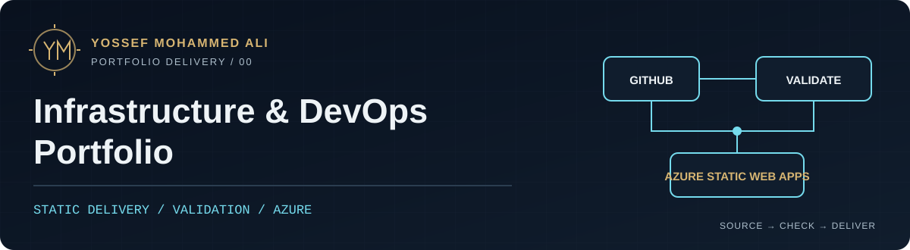
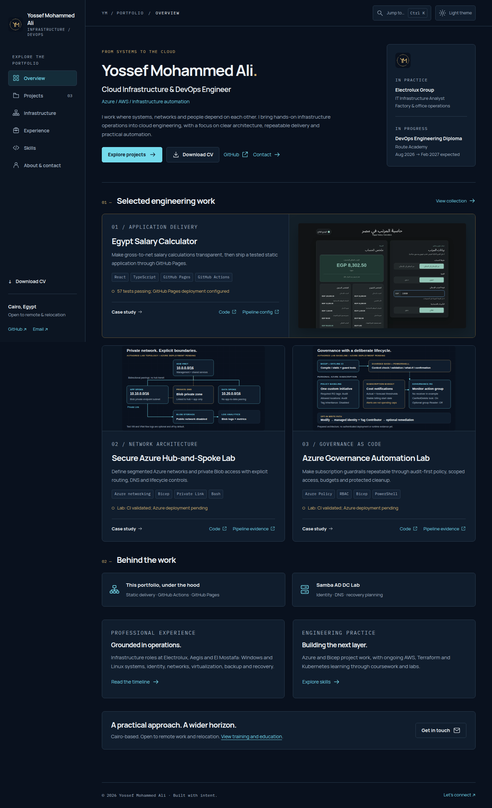
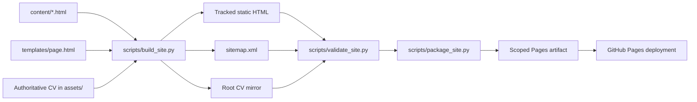

# Yossef Mohammed Ali — Infrastructure & DevOps Portfolio



A static portfolio designed as an infrastructure command centre: compact application navigation, evidence-led case studies, readable architecture views, and a clear boundary between professional experience and personal lab work.

[](https://github.com/yossefseit/yossefseit.github.io/actions/workflows/deploy-pages.yml)
[](LICENSE)

[Portfolio](https://yossefseit.github.io/) ·
[Projects](https://yossefseit.github.io/projects/) ·
[GitHub profile](https://github.com/yossefseit) ·
[Download CV](https://yossefseit.github.io/Yossef_Mohammed_Ali_CV.pdf)

> GitHub Pages delivery is configured. The first run and public verification of this release remain pending until the reviewed changes reach `main`.



[Light theme preview](docs/screenshots/pages-landing-light-desktop.png) ·
[Mobile landing preview](docs/screenshots/pages-landing-mobile.png) ·
[Expanded mobile navigation](docs/screenshots/pages-mobile-navigation.png) ·
[Infrastructure view](docs/screenshots/pages-infrastructure-desktop.png) ·
[Salary Calculator case study](docs/screenshots/pages-salary-case-desktop.png)

## Experience

- Responsive application shell with desktop sidebar navigation and a compact mobile menu
- Persistent light and dark themes, visible keyboard focus, and reduced-motion support
- Keyboard-accessible command palette for real routes and actions
- Shareable case studies with architecture, decisions, validation, status, and learning
- Infrastructure view covering the portfolio delivery path and personal cloud and identity labs
- Self-hosted Manrope and IBM Plex Mono fonts with no runtime third-party dependency
- Canonical metadata, Open Graph images, structured data, sitemap coverage, and a custom 404
- GitHub Pages artifact delivery after generated output and repository checks pass

The CV is the authority for employment titles, dates, education, and training status. Repository and workflow evidence support project claims separately. The site does not present personal labs as employer systems.

## Selected work

| Project | Current status | Evidence |
|---|---|---|
| [Egypt Salary Calculator](https://yossefseit.github.io/projects/egypt-salary-calculator/) | 57 tests passing; GitHub Pages deployment configured | [Demo target](https://yossefseit.github.io/egypt-salary-calculator/) · [Source](https://github.com/yossefseit/egypt-salary-calculator) · [Pages workflow](https://github.com/yossefseit/egypt-salary-calculator/blob/main/.github/workflows/deploy-pages.yml) · [Historical Azure run](https://github.com/yossefseit/egypt-salary-calculator/actions/runs/31909528455) |
| [Secure Azure Hub-and-Spoke Lab](https://yossefseit.github.io/projects/azure-secure-hub-spoke/) | Lab: CI validated; Azure deployment pending | [Source](https://github.com/yossefseit/azure-secure-hub-spoke) · [CI evidence](https://github.com/yossefseit/azure-secure-hub-spoke/actions/runs/30944553717) |
| [Azure Governance Automation Lab](https://yossefseit.github.io/projects/azure-governance-automation/) | Lab: CI validated; Azure deployment pending | [Source](https://github.com/yossefseit/azure-governance-automation) · [CI evidence](https://github.com/yossefseit/azure-governance-automation/actions/runs/31267342614) |
| [Samba AD DC Lab](https://yossefseit.github.io/projects/samba-ad-dc-lab/) | Lab: CI validated; runtime validation pending | [Source](https://github.com/yossefseit/samba-ad-dc-lab) · [Workflows](https://github.com/yossefseit/samba-ad-dc-lab/actions) |
| GitHub Pages Portfolio | Pages deployment configured; first production run pending | This repository, its [workflow](.github/workflows/deploy-pages.yml), artifact staging script, and [delivery notes](docs/deployment.md) |

The Salary Calculator's current status describes its checked workflow configuration. Its successful August 2026 App Service run remains dated historical evidence and does not establish current demo availability. The Azure and Samba lab statuses distinguish authored, CI-validated work from pending authenticated or runtime validation.

## Public routes

The generator produces ten directly linkable pages:

| Route | Purpose |
|---|---|
| `/` | Concise identity, primary actions, and selected projects |
| `/projects/` | Curated project collection |
| `/infrastructure/` | Portfolio delivery and personal lab architectures |
| `/experience/` | Professional experience, training, and education |
| `/skills/` | Cloud, automation, delivery, systems, and reliability skills |
| `/about/` | Brief background, contact details, and CV access |
| `/projects/egypt-salary-calculator/` | Application delivery case study |
| `/projects/azure-secure-hub-spoke/` | Azure networking case study |
| `/projects/azure-governance-automation/` | Azure governance case study |
| `/projects/samba-ad-dc-lab/` | Identity automation case study |

`404.html` follows the GitHub Pages custom-error convention. Existing route names remain intact.

## Source and delivery model


```mermaid
flowchart LR
    Content["content/*.html"] --> Generator["scripts/build_site.py"]
    Shell["templates/page.html"] --> Generator
    CVSource["Authoritative CV in assets/"] --> Generator
    Generator --> Pages["Tracked static HTML"]
    Generator --> Sitemap["sitemap.xml"]
    Generator --> CVMirror["Root CV mirror"]
    Pages --> Validator["scripts/validate_site.py"]
    Sitemap --> Validator
    CVMirror --> Validator
    Validator --> Package["scripts/package_site.py"]
    Package --> Artifact["Scoped Pages artifact"]
    Artifact --> Deploy["GitHub Pages deployment"]
```

Shared navigation, metadata, command-palette entries, project cards, and page chrome are generated from one Python script and template. Page-specific content stays in small HTML fragments. Generated HTML is checked in, then `package_site.py` stages only the public surface in `_site/` for upload.

The site has no application server, database, API, analytics, authentication, or frontend framework. Vanilla JavaScript handles theme persistence, mobile navigation, and the command palette. Core navigation and content remain available if those enhancements do not run.

See [Architecture](docs/architecture.md) for the browser security model, delivery boundary, and historical Azure evidence.

## Repository map

```text
.
├── .github/workflows/deploy-pages.yml # Validation and GitHub Pages delivery
├── assets/                             # CSS, JavaScript, fonts, images, source PDFs
├── content/                            # Page-specific HTML fragments
├── docs/                               # Architecture, delivery, validation, evidence
├── infra/main.bicep                    # Retired Azure host definition; historical only
├── scripts/
│   ├── build_site.py                   # Pages, metadata, meta CSP, root CV mirror
│   ├── package_site.py                 # Scoped GitHub Pages artifact staging
│   └── validate_site.py                # Dependency-free structural validator
├── templates/page.html                 # Shared application shell
├── about/                              # Generated route output
├── experience/                         # Generated route output
├── infrastructure/                     # Generated route output
├── projects/                           # Generated catalogue and case studies
├── skills/                             # Generated route output
├── 404.html                            # Custom error page
├── index.html                          # Generated landing page
├── sitemap.xml                         # Generated canonical route list
└── Yossef_Mohammed_Ali_CV.pdf          # Generated byte-identical public CV mirror
```

## Work locally

Python 3 is enough to generate, validate, stage, and serve the site.

```bash
git clone https://github.com/yossefseit/yossefseit.github.io.git
cd yossefseit.github.io
python3 scripts/build_site.py
python3 scripts/build_site.py --check
python3 scripts/validate_site.py
python3 scripts/package_site.py
python3 -m http.server 8000
```

Open `http://localhost:8000/`. Use `Ctrl+K` or `Command+K` to open the command palette.

Edit `content/*.html` for page copy and `templates/page.html` for shared structure, then run the generator. The workflow also checks JavaScript, HTML, CSS, Markdown, spelling, the retired Bicep definition, and tracked secrets.

## Replace the CV

Every GitHub-facing CV link uses:

```text
https://yossefseit.github.io/Yossef_Mohammed_Ali_CV.pdf
```

After exporting from Overleaf, overwrite `assets/Yossef_Mohammed_Ali_CV.pdf` without changing its filename or case. Then regenerate and validate:

```bash
python3 scripts/build_site.py
python3 scripts/build_site.py --check
python3 scripts/validate_site.py
```

The generator creates the root public copy and the validator requires it to be byte-identical to the authoritative asset. GitHub Pages does not provide repository-defined response cache rules, so replacing a stable URL may remain cached temporarily at browser or edge level.

## Delivery and security

The canonical origin is `https://yossefseit.github.io/`. A validated push to `main` uploads a scoped artifact and deploys it through the `github-pages` environment. The deploy job receives only `pages: write` and `id-token: write`; no Azure token is used.

Repository administrators must select **Settings → Pages → Build and deployment → Source: GitHub Actions** once before the custom workflow can publish. The repository setting is external to this code change.

GitHub Pages does not support repository-defined response headers. Each HTML document therefore includes a deny-by-default meta Content Security Policy and a referrer policy. A meta policy cannot set HSTS, framing controls, MIME controls, Permissions Policy, COOP, CORP, response caching, or other HTTP headers. External profile, repository, and workflow links are ordinary anchors; the site loads no third-party script or frame.

The former Azure Static Web Apps workflow and runtime configuration have been removed. `infra/main.bicep` and the redacted portal screenshot remain clearly labelled historical evidence of the retired host; neither participates in current delivery.

See [Deployment](docs/deployment.md) for the review, publication, verification, and rollback procedure. The latest executed checks are recorded in [Validation](docs/validation.md).

## Evidence boundary

- **Professional experience:** Electrolux Group, Aegis, and El Mostafa for Master Batch, with titles and dates taken from the current CV.
- **Training:** Route Academy DevOps Engineering Diploma remains in progress from August 2026 to expected February 2027. Its planned AWS and Kubernetes capstone is future coursework.
- **Completed academy programs:** IT-Gate Azure Cloud Engineering, 220 training hours; IT-Gate IT Infrastructure, 240 training hours.
- **Project and lab work:** documented from source, workflows, diagrams, tests, and dated deployment evidence. Lab implementation is not presented as professional experience.
- **Infrastructure as Code:** the networking and governance projects remain deployment-pending labs. The portfolio Bicep file describes a retired host.

Planned work and acceptance criteria remain in the [Azure lab roadmap](docs/azure-lab-roadmap.md).

## License

Source code and original documentation are available under the [MIT License](LICENSE). The CV, academy documents, and third-party marks are personal or issuer-provided material and are not granted for reuse by that license.
