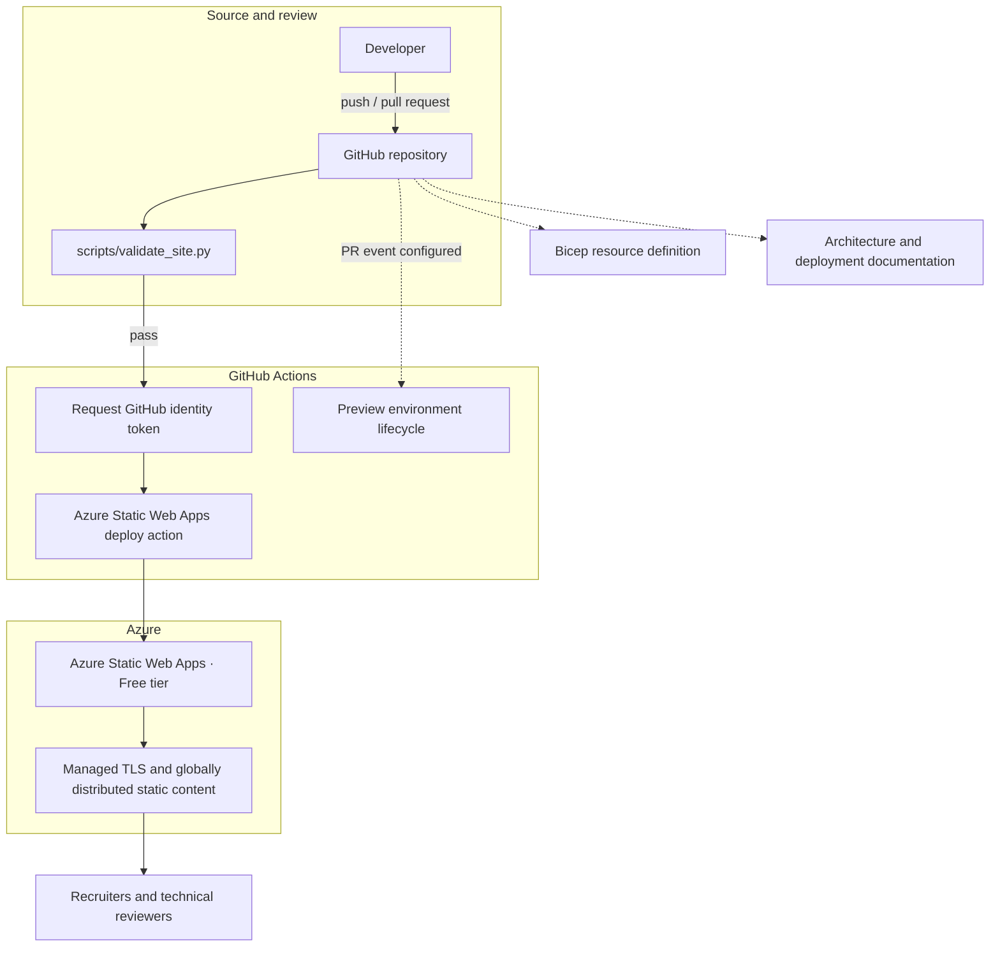

# Architecture

## System context

This repository serves two purposes:

1. a recruiter-facing portfolio for Azure and cloud infrastructure roles;
2. a small, inspectable Azure Static Web Apps reference implementation.

The application is deliberately static. It has no server, database, API, analytics, user authentication, or frontend framework.



## Primary origin

The production and canonical origin is:

`https://gentle-smoke-06d712d0f.7.azurestaticapps.net/`

GitHub Pages currently serves the same repository as a secondary mirror. Canonical, Open Graph, JSON-LD, robots, and sitemap signals all select the Azure host to prevent conflicting search signals. Disabling GitHub Pages remains an external repository-setting task.

## Azure Static Web Apps

Azure Static Web Apps supplies:

- managed HTTPS/TLS;
- globally distributed static delivery;
- GitHub Actions integration;
- staging environments for pull requests;
- a Free tier suitable for this portfolio.

The workflow monitors `main` pushes and pull-request open, synchronize, reopen, and close events. Preview creation and cleanup are configured for trusted same-repository pull requests, but the repository has not yet recorded a PR-triggered Azure run. Dependabot and fork pull requests run validation without attempting a secret-backed preview deployment. Documentation therefore describes previews as **configured**, not proven through a completed lifecycle test.

Concurrency groups use the branch reference for pushes and the pull-request number for the complete preview lifecycle. A merged pull request's cleanup event therefore cannot cancel the simultaneous `main` production deployment.

## Validation and delivery

The workflow has three jobs with distinct responsibilities:

1. **Validate static site** — checks local references, anchors, metadata, structured data, JSON/XML configuration, CSP, sitemap, and the custom 404.
2. **Deploy to Azure Static Web Apps** — runs only after validation succeeds for a deployable event.
3. **Remove preview environment** — runs on a closed pull request and passes the stored Azure deployment token to the close action.

Third-party actions are pinned to full commit SHAs. Checkout does not persist credentials. Each job declares only the permissions it needs and has a timeout.

The deployment action receives:

- the Static Web Apps deployment token from GitHub Actions secrets; and
- a short-lived GitHub identity token requested during the job.

No secret value is present in the repository.

## No application build

The frontend is already deployable HTML, CSS, JavaScript, images, and documents. The workflow therefore sets:

```yaml
app_location: /
api_location: ""
output_location: ""
skip_app_build: true
skip_api_build: true
```

This bypasses Oryx instead of adding a package manifest and a no-op build purely for the hosting platform.

## Infrastructure as Code boundary

`infra/main.bicep` defines the intended Static Web App shape:

- resource-group deployment scope;
- resource name and permitted regions;
- Free or Standard SKU;
- root application path;
- no API or output directory;
- GitHub workflow generation disabled;
- staging environments enabled.

The production resource was initially connected through the Azure Portal. Bicep was added afterward to codify its intended state. There is no authenticated Bicep deployment or what-if result in this repository, so the accurate claim is **Bicep resource definition**, not **production provisioned by Bicep**.

The template deliberately omits `repositoryUrl` and `repositoryToken`. The checked-in workflow owns delivery, and no repository token should be passed through the resource template.

## Browser security model

`staticwebapp.config.json` applies:

- a deny-by-default Content Security Policy;
- self-hosted scripts, styles, fonts, and images only;
- a hash for the inline JSON-LD structured-data block;
- no frames, objects, media, workers, connections, or form submissions;
- HSTS, MIME sniffing protection, referrer controls, and framing protection;
- COOP/CORP isolation headers and a restrictive Permissions Policy.

Credly badges are ordinary links. No third-party script or iframe is loaded.

If the JSON-LD block changes, its SHA-256 source hash must also be updated in `staticwebapp.config.json`. The validator checks that relationship.

## Caching

Unversioned frontend assets use a short, revalidating cache. Training PDFs use a one-day revalidating cache. The CV is always revalidated so recruiters do not retain a year-old copy after an update.

Long-lived immutable caching should only be reintroduced after filenames are content-hashed.

## Error handling

Azure rewrites 404 responses to `/404.html`. The same file also follows GitHub Pages' conventional custom-404 behavior. It is marked `noindex, follow`.

## Public surface

Azure currently uploads from the repository root. Because the repository is already public, its README, runbooks, Bicep, and validation script contain no confidential information. The trade-off avoids introducing a build directory while GitHub Pages is still active.

Once GitHub Pages is disabled, a future pipeline can assemble a dedicated public artifact and deploy only runtime files.
