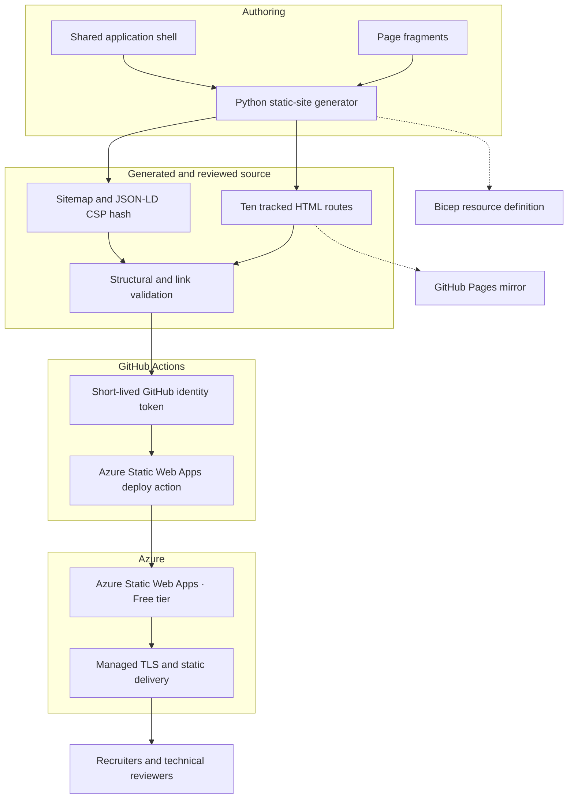

# Architecture

## System context

This repository serves two connected purposes:

1. a recruiter-facing portfolio for cloud infrastructure, DevOps, and IT infrastructure roles;
2. a small, inspectable Azure Static Web Apps delivery project.

The application is static. It has no server, database, API, analytics, user authentication, or frontend framework.


```mermaid
flowchart TD
    subgraph Authoring["Authoring"]
        Content["Page fragments"]
        Template["Shared application shell"]
        Generator["Python static-site generator"]
        Content --> Generator
        Template --> Generator
    end

    subgraph Review["Generated and reviewed source"]
        Generator --> Pages["Ten tracked HTML routes"]
        Generator --> Metadata["Sitemap and JSON-LD CSP hash"]
        Pages --> Validator["Structural and link validation"]
        Metadata --> Validator
    end

    subgraph Delivery["GitHub Actions"]
        Validator --> Identity["Short-lived GitHub identity token"]
        Identity --> Upload["Azure Static Web Apps deploy action"]
    end

    subgraph Azure["Azure"]
        Upload --> SWA["Azure Static Web Apps · Free tier"]
        SWA --> Edge["Managed TLS and static delivery"]
    end

    Edge --> Visitors["Recruiters and technical reviewers"]
    Pages -.-> GitHubPages["GitHub Pages mirror"]
    Generator -.-> IaC["Bicep resource definition"]
```

## Authoring and generation

The source model keeps repeated presentation in one place while preserving plain static output:

- `templates/page.html` defines the document head, application shell, navigation, footer, and command dialog.
- `content/*.html` contains route-specific copy, diagrams, evidence, and case-study sections.
- `scripts/build_site.py` combines those sources with shared navigation, project data, metadata, and structured data.
- Generated `index.html` files are tracked and uploaded directly.
- The same generator writes `sitemap.xml` and synchronizes the inline JSON-LD hash in `staticwebapp.config.json`.
- `404.html` is maintained separately as the custom unknown-route document.

`python3 scripts/build_site.py --check` renders expected output in memory and fails when any tracked generated file is stale. The delivery workflow runs this check before structural validation or deployment.

The generator currently owns these routes:

- `/`
- `/projects/`
- `/infrastructure/`
- `/experience/`
- `/skills/`
- `/about/`
- `/projects/egypt-salary-calculator/`
- `/projects/azure-secure-hub-spoke/`
- `/projects/azure-governance-automation/`
- `/projects/samba-ad-dc-lab/`

## Browser application shell

The visual system uses deep ink and charcoal surfaces, off-white text, cyan topology and links, and restrained gold identity accents. Manrope and IBM Plex Mono are self-hosted, so the browser does not contact a font provider.

The shared shell supplies:

- a persistent desktop sidebar;
- a compact mobile navigation control;
- a theme control with local preference persistence;
- a native dialog-based command palette opened with `Ctrl+K` or `Command+K`;
- semantic landmarks, one primary heading per page, visible focus, and reduced-motion behavior;
- project-specific Open Graph images and accessible architecture artwork.

`assets/theme.js` applies a stored theme early enough to avoid a visible theme switch. `assets/site.js` progressively adds the mobile menu, theme control, and command palette. Navigation and primary content remain available without JavaScript.

The mobile layout preserves readable labels and constrains scalable diagrams so the document does not create horizontal overflow. Architecture images link to their full SVG form for closer inspection.

## Primary origin

The production and canonical origin is:

`https://gentle-smoke-06d712d0f.7.azurestaticapps.net/`

GitHub Pages can serve the same repository as a secondary mirror. Canonical, Open Graph, JSON-LD, robots, and sitemap signals select the Azure origin. Disabling GitHub Pages remains an external repository-setting task.

The exact CV route is:

`/assets/Yossef_Mohammed_Ali_CV.pdf`

The local redesign uses that path consistently. It becomes available at the canonical origin when the redesign and supplied PDF are published.

## Azure Static Web Apps

Azure Static Web Apps supplies:

- managed HTTPS/TLS;
- globally distributed static delivery;
- GitHub Actions integration;
- staging environments for pull requests;
- a Free tier suitable for this portfolio.

The workflow monitors `main` pushes and pull-request open, synchronize, and reopen events. Pull request #7 verified preview creation for a trusted same-repository branch. Azure ties preview environments to pull requests and manages their cleanup. Dependabot and fork pull requests run validation without attempting a secret-backed preview deployment.

Concurrency groups use the branch reference for pushes and the pull-request number for previews. A pull-request deployment therefore does not cancel an unrelated `main` production deployment.

## Validation and delivery

The workflow has two jobs with separate responsibilities:

1. **Validate static site** — checks generated-file freshness, local references, anchors, metadata, structured data, JSON and XML, the CSP relationship, sitemap coverage, the custom 404, JavaScript, HTML, CSS, Markdown, spelling, Bicep, and tracked secrets.
2. **Deploy to Azure Static Web Apps** — runs only after validation succeeds for a deployable event.

Third-party actions are pinned to full commit SHAs. Checkout does not persist credentials. Each job declares only its required permissions and has a timeout.

The deployment action receives the Static Web Apps deployment token from GitHub Actions secrets and a short-lived GitHub identity token. Pull request #8 confirmed that upload fails without `github_id_token`, although the pinned action metadata does not declare that runtime-consumed input and GitHub therefore emits an annotation. The unsupported `skip_api_build` input remains removed.

No secret value is present in the repository.

## No application build on Azure

The repository already contains deployable HTML, CSS, JavaScript, images, fonts, and documents. The workflow uses:

```yaml
app_location: /
api_location: ""
output_location: ""
skip_app_build: true
```

The Python generation step runs before review and commits its output. Azure then uploads the repository without Oryx framework detection or a synthetic package build.

## Infrastructure as Code boundary

`infra/main.bicep` defines the intended Static Web App shape:

- resource-group deployment scope;
- confirmed target resource group `rg-portfolio`;
- confirmed resource name `portfolio-yossef`;
- ARM location `eastus2` and permitted alternative regions;
- Free or Standard SKU;
- root application path;
- no API or output directory;
- GitHub workflow generation disabled;
- staging environments enabled.

The production resource was initially connected through the Azure Portal. Bicep was added later to record its intended state. A resource-owner-supplied [redacted Portal overview](screenshots/azure-static-web-app-overview-redacted.png) confirms that `portfolio-yossef` is ready in production on the Free plan with the documented default hostname. The Portal displays the globally delivered service as **Global**; the resource JSON reports the ARM deployment location as `eastus2`, which is the value used by Bicep.

There is no authenticated Bicep deployment or `what-if` result in this repository. The supported claim is **Bicep resource definition**, rather than production provisioned by Bicep.

The template deliberately omits `repositoryUrl` and `repositoryToken`, and `skipGithubActionWorkflowGeneration` remains enabled. The checked-in workflow owns delivery and must not be generated or rewritten by the resource template.

## Browser security model

`staticwebapp.config.json` applies:

- a deny-by-default Content Security Policy;
- self-hosted scripts, styles, fonts, and images;
- one SHA-256 authorization for the inline JSON-LD structured-data block;
- blocked frames, objects, media, workers, connections, and form submissions;
- HSTS, MIME sniffing protection, referrer controls, and framing protection;
- COOP and CORP isolation headers;
- a restrictive Permissions Policy.

External profile, repository, and workflow links are ordinary anchors. The site loads no third-party script or embedded frame.

When homepage structured data changes, the generator computes the matching CSP source hash. The structural validator independently checks that relationship.

## Caching

Cache rules use different policies for different content:

- `/assets/Yossef_Mohammed_Ali_CV.pdf` always revalidates, allowing a later CV replacement at the stable public path;
- academy PDF assets use a one-day revalidating cache;
- other unversioned assets use a one-hour revalidating cache.

Long-lived immutable caching should wait until asset filenames are content-hashed.

## Error handling

Azure rewrites 404 responses to `/404.html`. The same file follows GitHub Pages' custom-404 convention and is marked `noindex, follow`.

## Public surface

Azure uploads from the repository root. The repository is public, and its documentation, Bicep, generator, and validator contain no confidential values. This layout preserves compatibility with the current GitHub Pages mirror and avoids a second build artifact.

A dedicated output directory could narrow the published surface after the mirror is retired, but it would require coordinated workflow and hosting changes.
