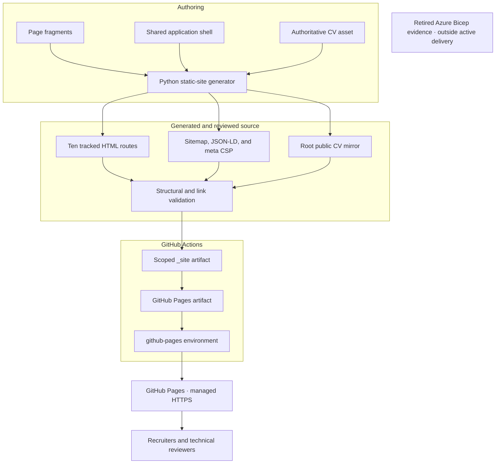

# Architecture

## System context

This repository serves two connected purposes:

1. a recruiter-facing portfolio for cloud infrastructure, DevOps, and IT infrastructure roles;
2. a small, inspectable GitHub Pages delivery project.

The application is static. It has no server, database, API, analytics, user authentication, or frontend framework.

```mermaid
flowchart TD
    subgraph Authoring["Authoring"]
        Content["Page fragments"]
        Template["Shared application shell"]
        CVSource["Authoritative CV asset"]
        Generator["Python static-site generator"]
        Content --> Generator
        Template --> Generator
        CVSource --> Generator
    end

    subgraph Review["Generated and reviewed source"]
        Generator --> Pages["Ten tracked HTML routes"]
        Generator --> Metadata["Sitemap, JSON-LD, and meta CSP"]
        Generator --> CVMirror["Root public CV mirror"]
        Pages --> Validator["Structural and link validation"]
        Metadata --> Validator
        CVMirror --> Validator
    end

    subgraph Delivery["GitHub Actions"]
        Validator --> Stage["Scoped _site artifact"]
        Stage --> Upload["GitHub Pages artifact"]
        Upload --> Deploy["github-pages environment"]
    end

    Deploy --> PagesHost["GitHub Pages · managed HTTPS"]
    PagesHost --> Visitors["Recruiters and technical reviewers"]
    RetiredIaC["Retired Azure Bicep evidence · outside active delivery"]
```

## Authoring and generation

The source model keeps repeated presentation in one place while preserving plain static output:

- `templates/page.html` defines the document head, application shell, navigation, footer, and command dialog.
- `content/*.html` contains route-specific copy, diagrams, evidence, and case-study sections.
- `scripts/build_site.py` combines those sources with shared navigation, project data, metadata, and structured data.
- The generator writes the ten tracked HTML routes and `sitemap.xml`.
- The generator mirrors `assets/Yossef_Mohammed_Ali_CV.pdf` to the root public filename without changing the authoritative asset.
- `404.html` is maintained separately for GitHub Pages' custom-error convention.

`python3 scripts/build_site.py --check` renders expected output in memory and fails when tracked generated output is stale. For the binary CV, it compares bytes rather than decoding the document as text.

The generator owns these routes:

- `/`
- `/projects/`
- `/infrastructure/`
- `/experience/`
- `/skills/`
- `/about/`
- `/projects/egypt-salary-calculator/`
- `/projects/azure-secure-hub-spoke/`
- `/projects/azure-governance-automation/`
- `/projects/samba-ad-dc-lab/`

## Browser application shell

The visual system uses deep ink and charcoal surfaces, off-white text, cyan topology and links, and restrained gold identity accents. Manrope and IBM Plex Mono are self-hosted, so the browser does not contact a font provider.

The shared shell supplies:

- a persistent desktop sidebar;
- a compact mobile navigation control;
- a theme control with local preference persistence;
- a native dialog-based command palette opened with `Ctrl+K` or `Command+K`;
- semantic landmarks, one primary heading per page, visible focus, and reduced-motion behavior;
- project-specific Open Graph images and accessible architecture artwork.

`assets/theme.js` applies a stored theme before the main stylesheet renders. `assets/site.js` progressively adds the mobile menu, theme control, and command palette. Navigation and primary content remain available without JavaScript.

## Canonical origin and CV

The production and canonical target is:

`https://yossefseit.github.io/`

Canonical, Open Graph, JSON-LD, robots, and sitemap signals all use that origin. Public verification of the Actions-built release remains pending until the reviewed changes reach `main` and the Pages source is set to GitHub Actions.

The public CV URL is:

`https://yossefseit.github.io/Yossef_Mohammed_Ali_CV.pdf`

Generated website links use `/Yossef_Mohammed_Ali_CV.pdf`. GitHub-facing documentation uses the absolute URL. The structural validator requires the root file to be byte-identical to `assets/Yossef_Mohammed_Ali_CV.pdf`.

## GitHub Pages workflow

The workflow watches pull requests to `main`, pushes to `main`, and manual dispatches. It separates validation and delivery:

1. **Validate and package static site** checks generation drift, local references, metadata, JSON-LD, the meta Content Security Policy, JavaScript, HTML, CSS, Markdown, spelling, the retired Bicep definition, and tracked secrets. It stages only the public surface and uploads a Pages artifact.
2. **Deploy to GitHub Pages** runs only for `main` outside pull-request events. It downloads the named Pages artifact through `actions/deploy-pages` and publishes through the `github-pages` environment.

The deploy job receives `pages: write` and `id-token: write`. The short-lived OIDC token binds the deployment to the GitHub Pages environment. No Azure token, cloud service-principal secret, or personal access token is required by the workflow.

Third-party actions are pinned to full commit SHAs. Checkout does not persist credentials. Each job declares its required permissions and timeout. One concurrency group serializes Pages releases, and `cancel-in-progress: false` prevents a newer run from interrupting an active production deployment.

Repository administrators must select **Settings → Pages → Build and deployment → Source: GitHub Actions** once. `actions/configure-pages` does not use automatic enablement because that path requires a separate administrative token. The repository setting cannot be established by this local change.

## Public artifact boundary

`scripts/package_site.py` recreates `_site/` and copies only:

- the landing page, custom 404, robots, sitemap, and Google verification file;
- the byte-identical root CV mirror;
- generated route directories;
- browser assets and supplied public documents.

The script adds `.nojekyll` inside the artifact. Source fragments, templates, scripts, workflow files, documentation, screenshots, and retired Bicep are excluded from the hosted surface. `actions/upload-pages-artifact` also rejects symbolic and hard links in its deployment archive.

## Browser security model

GitHub Pages does not accept a repository file for custom HTTP response headers. Each HTML document therefore includes:

- a deny-by-default meta Content Security Policy;
- self-hosted scripts, styles, fonts, and images;
- one SHA-256 authorization for the homepage JSON-LD block;
- blocked frames, objects, media, workers, connections, and form submissions;
- a `strict-origin-when-cross-origin` referrer policy.

The generator computes the JSON-LD source hash, and the structural validator independently verifies it. The 404 document has the same source restrictions without an inline-data hash.

A meta Content Security Policy begins enforcement only after the browser parses the element. It cannot express `frame-ancestors` and cannot provide HSTS, MIME sniffing controls, Permissions Policy, COOP, CORP, or other response headers. Those limits are stated directly rather than presenting the Pages host as equivalent to the retired Azure header configuration.

External profile, repository, and workflow links are ordinary anchors. The site loads no third-party script or embedded frame.

## Caching and error handling

GitHub Pages owns response caching. The repository cannot set an exact `Cache-Control` rule for the stable CV filename, so a replacement may remain in a browser or edge cache temporarily even after a successful release.

GitHub Pages uses `404.html` for unknown paths. The document is marked `noindex, follow` and declares no canonical URL. Production verification must confirm both the custom content and an actual `404` response after publication.

## Retired Azure host

The previous Static Web Apps workflow and `staticwebapp.config.json` have been removed because the Azure resource is no longer the hosting target. No current page, metadata record, sitemap entry, or delivery step points to the retired hostname.

`infra/main.bicep` and `docs/screenshots/azure-static-web-app-overview-redacted.png` remain as historical portfolio evidence. The Bicep file records the former resource shape; it does not participate in GitHub Pages delivery and does not imply that an Azure resource remains deployed. The workflow compiles it only to keep the retained example syntactically valid.
