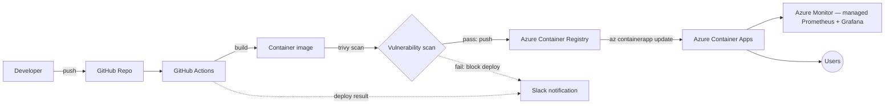

# Blueprint: Container Apps Reference Project (Planned)

Status: **planned**, not started. This is a design doc, not a build — written while the current repo (Static Web Apps) is still in progress. Captures the plan now so it doesn't need to be reconstructed later.

## Why this one's next

It's the natural step up from a static site: real containers, a registry, a proper CI/CD pipeline with a security-scan gate, and actual monitoring — without jumping straight to a full Kubernetes cluster before that's justified.

The shape of it borrows from [`khaledhawil/End-to-End-DevOps-AWS-Nodejs-Python-MySQL`](https://github.com/khaledhawil/End-to-End-DevOps-AWS-Nodejs-Python-MySQL) — a self-hosted RKE2 cluster running a Node/Python/MySQL app, with Flux for GitOps, Trivy for scanning, and Prometheus/Grafana for monitoring. Same core ideas, re-mapped to managed Azure services instead of self-hosted infrastructure:

| Their approach | Azure equivalent | Why |
|---|---|---|
| Self-managed RKE2 cluster | **Azure Container Apps** | Serverless containers — no nodes, no cluster upgrades to manage. (AKS is the equivalent if a future project specifically wants cluster-ops experience.) |
| DockerHub | **Azure Container Registry (ACR)** | Keeps the registry in the same cloud as the compute; supports Defender scanning natively. |
| Trivy scan in CI | **Trivy in GitHub Actions**, or **Defender for Containers** on ACR | Trivy is portable and worth keeping either way — same tool, same skill. |
| Flux reconciling a cluster | *(not needed)* | Container Apps has no cluster to reconcile — GitHub Actions deploys directly via `az containerapp update`. Flux/Argo CD would be the equivalent only if AKS is chosen instead. |
| Self-hosted Prometheus + Grafana | **Azure Monitor managed Prometheus + Azure Managed Grafana** | Same dashboards and query language, without operating the monitoring stack by hand — the more idiomatic Azure answer to the same problem. |
| Slack alerts on pipeline events | Same idea, same webhook step | No Azure-native change needed here. |

## Proposed architecture



## Planned repo structure

Same template as this repo, so the pattern stays consistent across the portfolio:

```
├── README.md              # overview, architecture, roadmap
├── docs/
│   ├── architecture.md
│   ├── deployment.md
│   └── screenshots/
├── infra/
│   └── main.bicep          # Container App + ACR + Log Analytics workspace
├── .github/workflows/      # build → scan → push → deploy
└── src/                    # the containerized app itself
```

## Open questions (resolve before starting)

- **Demo app**: reuse a simple existing app, or write something small and purpose-built for this repo?
- **Scan gate**: hard-fail the pipeline on high/critical CVEs, or report-only to start?
- **AKS later?**: keep as a *separate* future project rather than folding cluster-ops into this one — mixing "serverless containers" and "cluster management" in one repo would blur what each is meant to demonstrate.
